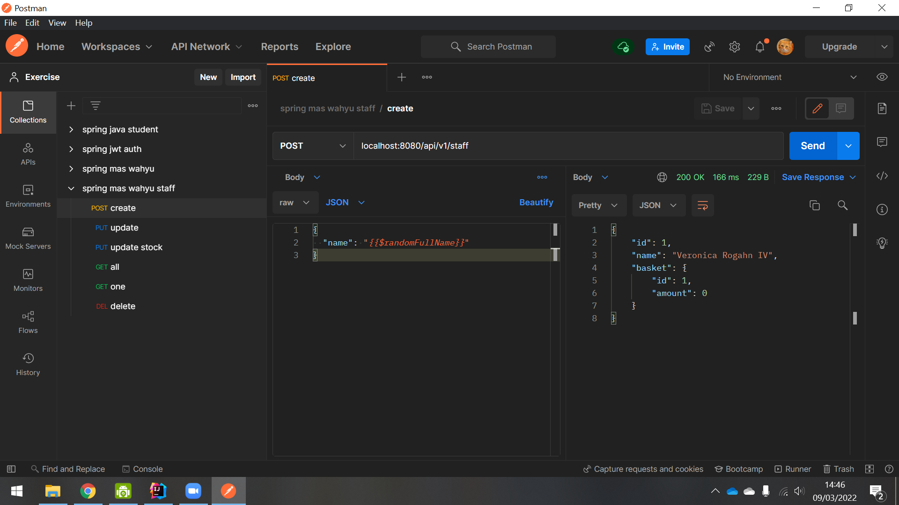
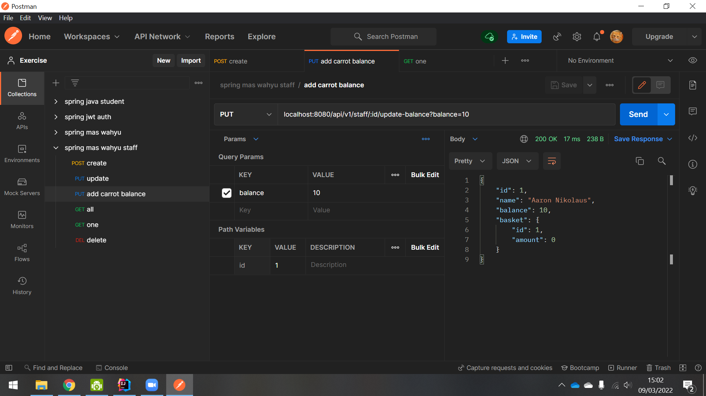

# Spring Boot Staff Assignment 

Name: Arif Ikhsanudin

## 1. I want to be able to add new staff ✅



## 2. I want to be able to add staff’s carrot balance ✅

initial balance is 0


add 10 balance



balance increased by 10 ✅


## 3. I want to be able to do transaction with my carrot ✅

### create staff


### create product

price = 949  
stock = 925


### add balance to staff (10000)


### buy product 

quantity = 2  
returned product entity


### staff balance
price = 949  
quantity = 2  
total price = 1898  
staff balance = 10000  
remaining staff balance (10000 - 1898) = 8102 ✅


### product sold

initial stock = 925  
bought stock = 2  
remaining stock (925 - 2) = 923 ✅


## 4. Record the transaction history in db ✅

same step from number 3


returning a response: 

```json
[
    {
        "id": 1,
        "staff": {
            "id": 1,
            "name": "Ellis Barrows PhD",
            "balance": 8616,
            "basket": {
                "id": 1,
                "amount": 0
            }
        },
        "product": {
            "id": 1,
            "productName": "Generic Fresh Car",
            "price": 692,
            "stock": 675
        },
        "quantity": 2,
        "createdAt": "2022-03-09T16:11:57.650905"
    }
]
```